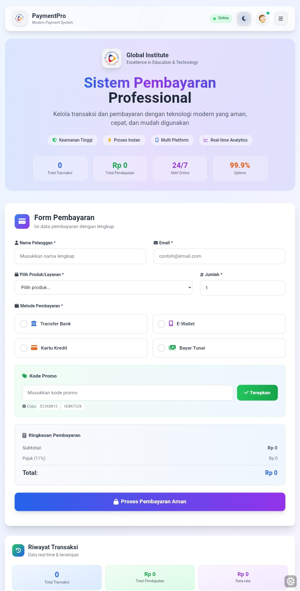
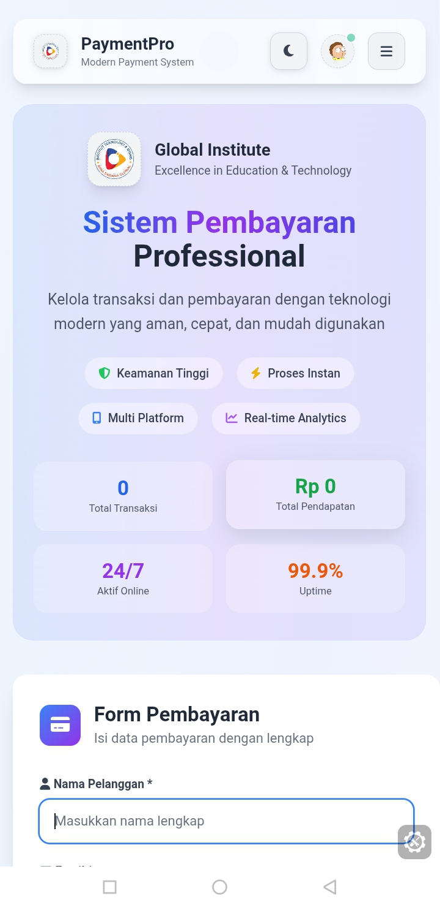

# Modern Payment System

**Modern Payment System Application**

---

## 📋 Daftar Isi

- [Tentang Aplikasi](#-tentang-aplikasi)
- [Fitur Utama](#-fitur-utama)
- [Screenshots](#-screenshots)
- [Demo & Links](#-demo--links)
---

## 🚀 Tentang Aplikasi

**Modern Payment System** adalah aplikasi pembayaran berbasis web. Sistem ini menyediakan platform pembayaran yang aman, efisien, dan user-friendly untuk mengelola berbagai jenis transaksi pendidikan dan layanan institusi.

### 🎯 Tujuan

- Menyediakan sistem pembayaran digital yang modern dan aman
- Memudahkan manajemen transaksi untuk institusi pendidikan
- Meningkatkan efisiensi proses pembayaran dan pelaporan
- Memberikan pengalaman pengguna yang optimal di semua perangkat

### 🏆 Keunggulan

- **Responsive Design**: Tampil sempurna di desktop, tablet, dan mobile
- **Dark/Light Mode**: Dukungan tema gelap dan terang
- **Real-time Processing**: Pemrosesan transaksi secara real-time
- **Secure**: Implementasi keamanan tingkat tinggi
- **Multi-Payment**: Mendukung berbagai metode pembayaran

---

## ✨ Fitur Utama

### 💳 Payment Processing
- **Multiple Payment Methods**: Transfer Bank, E-Wallet, Kartu Kredit, Cash
- **Real-time Calculation**: Perhitungan otomatis subtotal, diskon, pajak
- **Promo Code System**: Sistem kode promo dengan validasi
- **Custom Pricing**: Opsi harga kustom untuk paket khusus
- **Tax Calculation**: Perhitungan pajak otomatis (11%)

### 📊 Transaction Management
- **Live Transaction History**: Riwayat transaksi real-time
- **Advanced Search & Filter**: Pencarian dan filter berdasarkan berbagai kriteria
- **Export Functionality**: Export data ke format CSV
- **Receipt Generation**: Generate struk pembayaran dalam format HTML
- **Local Storage**: Penyimpanan data lokal untuk persistensi

### 🎨 User Interface
- **Modern Design**: Desain modern dengan glassmorphism effects
- **Dark/Light Theme**: Toggle tema dengan transisi smooth
- **Professional Branding**: Integrasi logo dan branding institusi
- **Mobile-First**: Desain responsif mobile-first approach
- **Accessibility**: Dukungan screen reader dan high contrast

### 📈 Analytics & Reporting
- **Real-time Statistics**: Statistik transaksi real-time
- **Revenue Tracking**: Pelacakan pendapatan total
- **Performance Metrics**: Metrik performa sistem
- **Visual Charts**: Grafik visual untuk analisis data

### 🔧 Technical Features
- **Form Validation**: Validasi form real-time dengan error handling
- **Error Recovery**: Sistem pemulihan error yang robust
- **Loading States**: Loading states untuk UX yang lebih baik
- **Notification System**: Sistem notifikasi toast yang elegant
- **Keyboard Shortcuts**: Dukungan keyboard shortcuts

---

## 📸 Screenshots

### Desktop Views

### Mobile Views

---

## 🔗 Demo & Links

### Live Demo
- Link : https://uas-ltnwi.kinsta.page/

---

